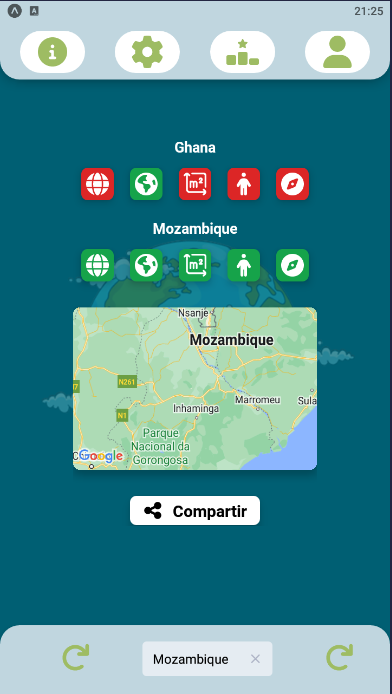
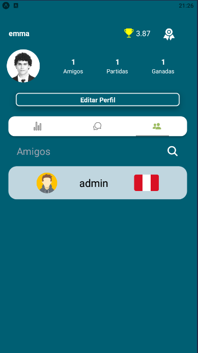
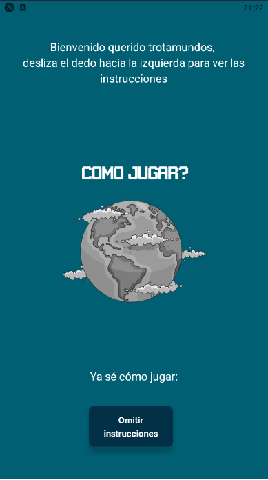
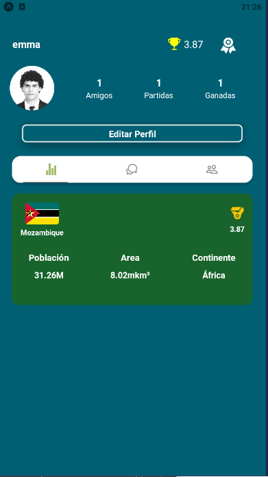

<h1 align="center">Hi 👋, I'm Felipe Tau</h1>
<h3 align="center">A passionate Full Stack Developer from Argentina</h3>

🤝I believe that teamwork is the key to success, we can all learn from one another. I love to share ideas and I also love to help when someone has a problem that they don't know how to solve. (And in case I don't know it, we can find the answer together)

I love to challenge myself and solve problems. And that's something that in programming I have to do constantly simply by nature.

<h4 align="left">Connect with me:</h4>

<h3 align="left">Languages and Tools:</h3>

              

&nbsp;

## Checkout my work
👇
👇
👇   
____________________
## Videogames SPA

~~~
📌 Proyecto Individual del Bootcamp Henry 
Me desempeñe como Full-Stack Developer

Diseñe y desarrolle una pagina web sobre videojuegos que incluye:
◉ Búsqueda por nombre
◉ Filtrado, Ordenamiento y Paginado
◉ Opción para crear un videojuego

Se utilizo: 
◉ Javascript
◉ ReactJS
◉ Redux
◉ CSS puro
◉ NodeJS
◉ Express
◉ PostgreSQL
◉ Sequelize
~~~

____________________
## World-Game  

~~~
📌 Un juego de móvil desarrollado para hacer la geografía más divertida

Proyecto grupal final del Bootcamp Henry. 
Me desempeñé como Front-End & Mobile Developer. 

El proyecto cuenta con una versión mobile, una versión web y un panel de administrador.

Tecnologías:
🎮 Database: PostgreSQL
🎮 Back-End: NodeJs, Express, Sequelize
🎮 Front-End: React JS, React Native, Redux, Tailwind, Material-UI, HTML
🎮 Librearías Adicionales: 
✔ Socket-IO (Chat integrado)
✔ Chart.js (Gráficas en tiempo real)
✔ Stripe (Pasarela de pagos)
✔ Cloudinary (Subir foto de perfil)
✔ Nodemailer (Envío de mails)
~~~

  

___________________________________________

## 📫 CONTACT ME

¿Quieres que trabajemos juntos?

**Email:** felipetau0@gmail.com

